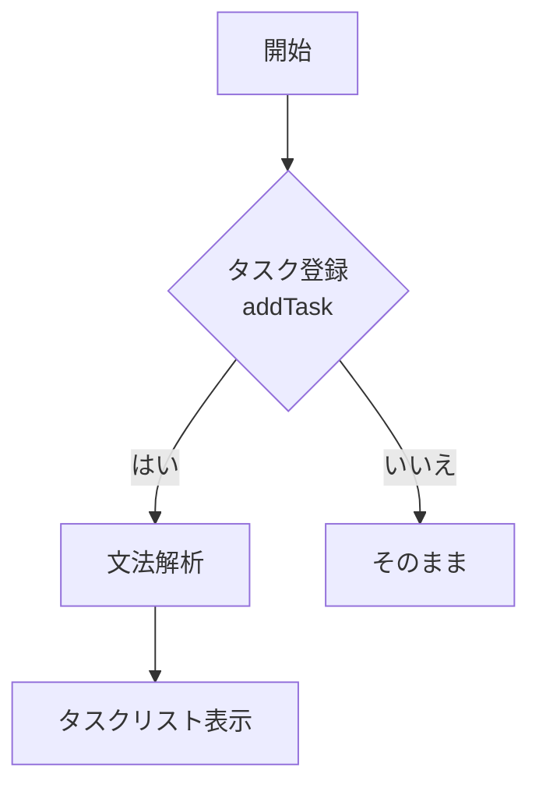
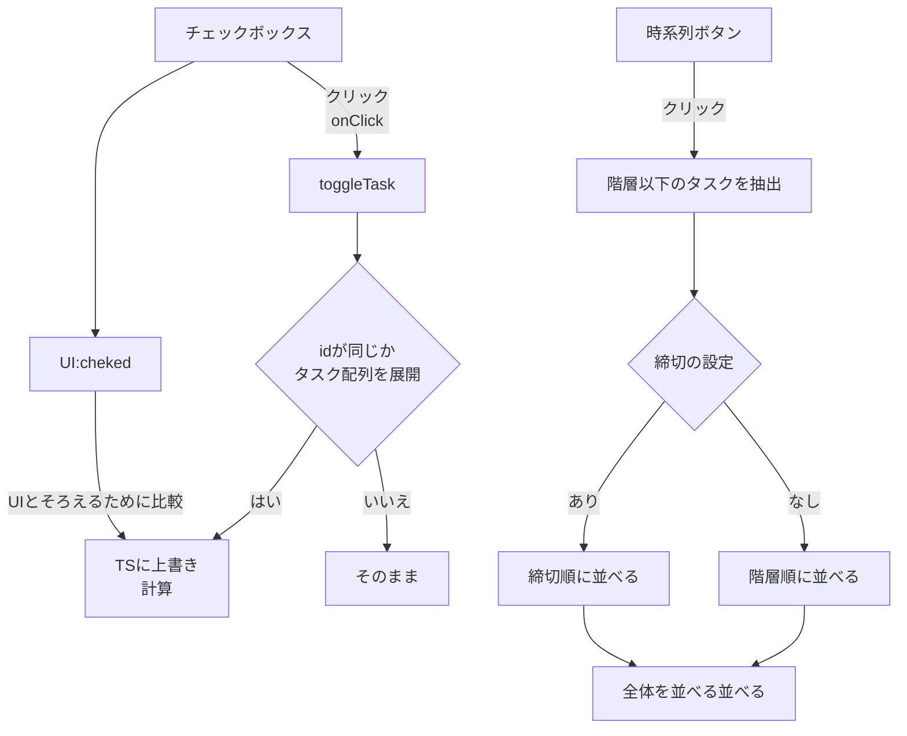
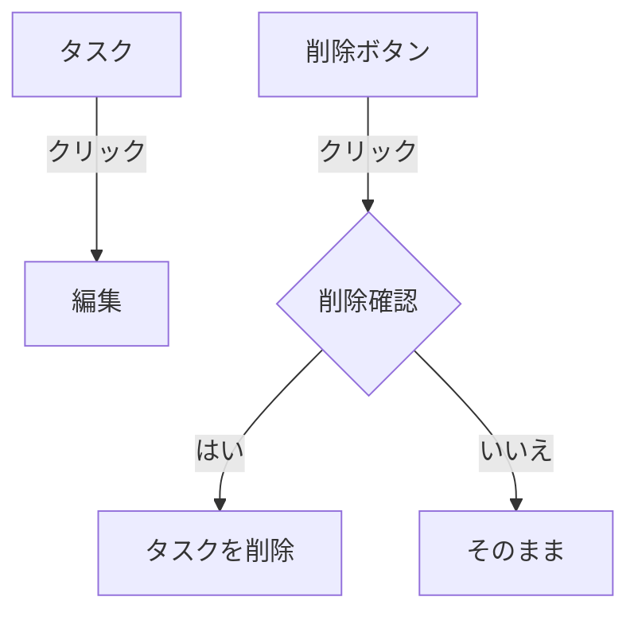
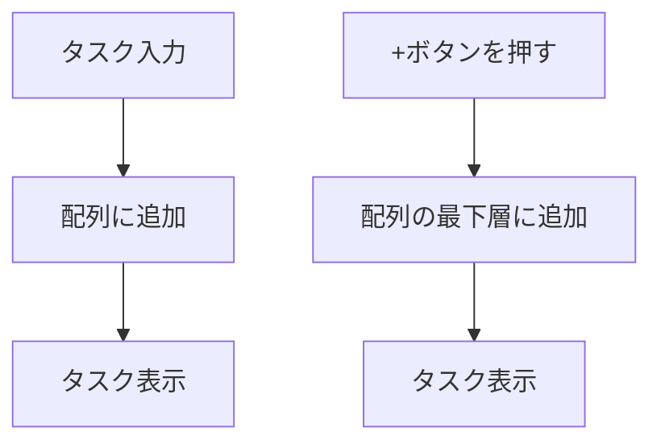

```mermaid
graph TD
  A[開始] --> B{タスク登録<br>addTask}
  B -- はい --> C[文法解析]
  B -- いいえ --> D[そのまま]
  C --> E[タスクリスト表示]
```

```mermaid
graph TD
A1[チェックボックス]--クリック<br>onClick-->C1[toggleTask]
A1-->F1[UI:cheked]
F1--UIとそろえるために比較-->E1
C1-->D1{idが同じか<br>タスク配列を展開}
D1--はい-->E1[TSに上書き<br>計算]
D1--いいえ-->G1[そのまま]


A3[時系列ボタン]--クリック-->B3[階層以下のタスクを抽出]
B3-->C3{締切の設定}
C3--あり-->D3[締切順に並べる]
C3--なし-->E3[階層順に並べる]
D3-->F3[全体を並べる並べる]
E3-->F3
```

```mermaid
graph TD
A2[タスク]--クリック-->B2[編集]

a4[削除ボタン]
a4--クリック-->b5{削除確認}
b5--はい-->c5[タスクを削除]
b5--いいえ-->そのまま
```

```mermaid
graph TD
a[タスク入力]-->b[配列に追加]
b-->c[タスク表示]
d[+ボタンを押す]-->e[配列の最下層に追加]
e-->f[タスク表示]
```
